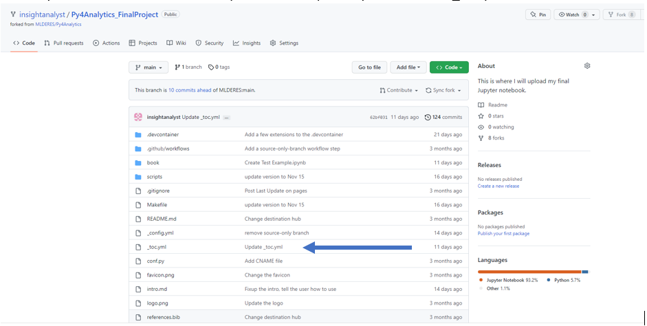
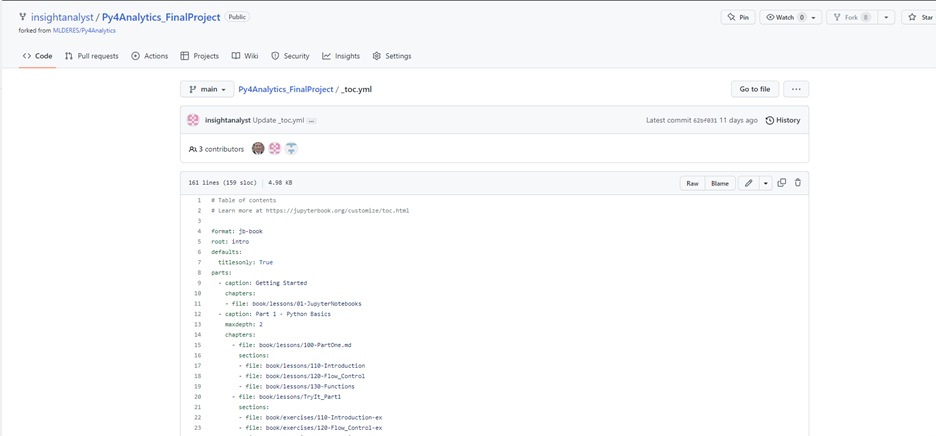
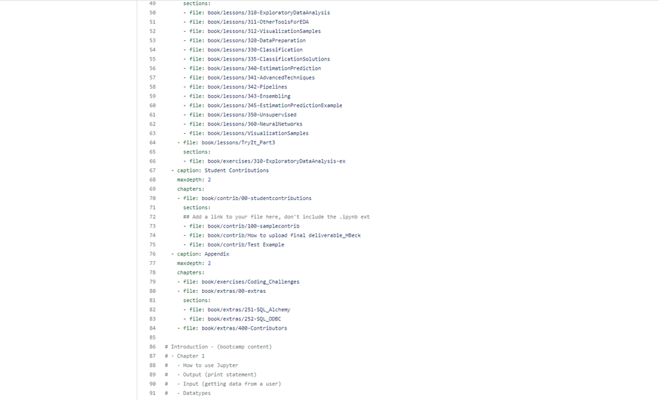
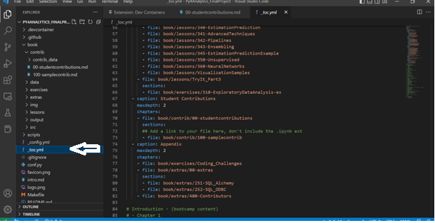
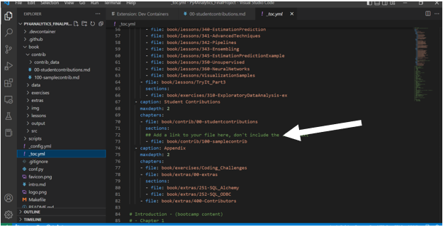

# Implementing/Creating Jupyter Notebook for final deliverable:

1) Ensure you have a [github.com](www.github.com) account. This is what the home screen looks like 

2) If you have never installed [GitDesktop](desktop.github.com), here is what it will bring you to

3) After install and configuration, you will come to here: 

4) Great. Now minimize this for a moment while we go and get a copy of the Py4Analytics book (there is a folder inside of this book where you will  upload your final Jupyter Notebook).  Go to py4analytics.info It should look like this 

5) Click the little cat looking thing in the top right corner. Click ‘repository’.

6) This opens the repository Prof. Dereszynski created for his book. 

7) In the top, right hand corner there is a “fork” button. Click that button. 

8) Here is the fork page:  

9) As stated on the page: A Fork is making a copy of the original that you can make changes to, without changing the original. This will be important to remember later on. \*Note: If you are doing this in future spaces, think about changing the name of the repository so that you don’t confuse what is the original and what is the copy. I am going to name mine, “Py4Analytics\_FinalProject”. For this project, keep “Copy the main branch only” checked. 

What it does while thinking… 

10) This is what it looks like when it completes. 

Notice that it looks exactly like the original, with one exception: My name is different from the original AND I can see a “forked from MLDERES/Py4Analytics”. This is a good thing. If you have it look like this, you are on the right path. Now, you need to go clone this forked repository to your local machine. Let’s go back to GitHub Desktop. 

11) This is now what my Desktop shows: You will click “Clone (whatever you named your repository)” 

12) Make sure you put this in a folder (path) that you can easily get to. For me, I am putting this in the same folder as my Jupyter Notebook. 

You have now successfully cloned your Forked copy to your local desktop.     

You will get this window after creating the clone: \*For the purpose of this book, we will only be using the “for my own purposes” option. If this were a class project/work project, it would be appropriate to use the “To contribule to the parent project”. 

# To just upload a file using the web interface 
13) The easiest way to get a copy of your Jupyter Notebook (the .ipynb file that will be your final deliverable) is to click “View the files of your repository in Explorer” and paste a copy of the final Jupyter Notebook into the “extras” folder. Below is what it looks like with no changes.

This is what Github Desktop looks like after changes (adding your file): 

14) Click “Commit to main” and the homepage will look like this: 

Then click “Push origin” and the screen will go back to one with no changes. However, if you go to the github.com website, you will see your file. 

15)	Before you do your pull request: **You must add your file name to the Table of Contents (TOC). Your final deliverable will not appear in the book if you have not completed this step.**

Ensure you are in the main screen of your forked repository. Look for the _toc.yml file and click on it.

It will open to this screen:

Scroll to the section that says "Student Contributions" (as of publish it was around Line 67)

Follow the instructions and add your file name. You can now proceed.

16) Once you are confident you want to deliver your final product, click “Contribute” and “Open pull request” 

17) This is the last page you will see before the file is submitted for review (and publishing). 

\***Note: if you make changes to your file (say you found a spelling mistake, or someone gave you a pointer on how to have more concise code), as long as the repository owner has not approved the pull request, you can make changes to the file. It is as simple as committing the file (from your local machine) and syncing the changes to the cloud (github.com website). Once the pull request has been approved, you will need to submit a new pull request.**

# How to see this in VS Code instead of web interfaces 
18) How to see it in VS Code is to follow. It might be helpful to rename this file with a “5713 – Your notebook name” so it is clear where this file came from (or from whom). When you have finished this, it should look like below.

19) This is how to get it back to Prof Dereszynski’s book. I am demonstrating this in VS Code. If you do not have VS Code, you will want to install it. Here is the link:[ VS Code ](contrib_img/https://code.visualstudio.com/download)
20) Click “Open File…”  
21) The folder you select will be the same folder (path) where you created the local copy of your forked Py4Analytics book. Here is what it will look like 

22) Double Click “book”. Then click “extras”. Select your Jupyter Notebook File. (If you have not installed the Python extension in VS Code as of this point, it will install it for you).  

23)	This is kind of important: if you do not add your information to the Table of Contents (see below), **your file will not be included in the final product**. You find this in the _toc.yml file.

24) Follow the instruction given in the script:

**Check to see if you have your file name in the TOC. If you do not see it, do not proceed until you have done this step. It is crucial to the final deliverable as it is what tells the book to look for your file. Follow the instructions above, or reach out to Professor Dereszynski for assistance.

25) After you see your file (on the left) and your code (on the right), Click on the **far left** the Triangle looking icon. This is called “Source Control”. It is important that, if you are making changes, you save often. A “save” in VS Code is called a “Commit”.

26) Here is the commit screen: Making a comment can be very helpful for your future self to try and recall what you were trying to accomplish.

\***Note**: you might get this dialogue box when committing your final file. Click “Yes”. 

27) Once you have “commit”ed your file, you need to “Sync Changes”. This takes the most current version of your project and adds them (or appends) to your cloud copy (in this case, it is the cloned copy of the Py4Analytics book).

Click “Ok”. 

\*Sidenote: it is possible for the “Sync Changes” to get stuck in a loop. If this happens, close out VS Code and return to the Github.com webpage. Click refresh and proceed to the next steps.  

28) This is what the “extras” folder looked before the changes:

` `Here is what it looks like after:

29) Once you are confident you want to deliver your final product, click “Contribute” and “Open pull request” 

30) This is the last page you will see before the file is submitted for review (and publishing). 

\***Note: if you make changes to your file (say you found a spelling mistake, or someone gave you a pointer on how to have more concise code), as long as the repository owner has not approved the pull request, you can make changes to the file. It is as simple as committing the file (from your local machine) and syncing the changes to the cloud (github.com website). Once the pull request has been approved, you will need to submit a new pull request.**
